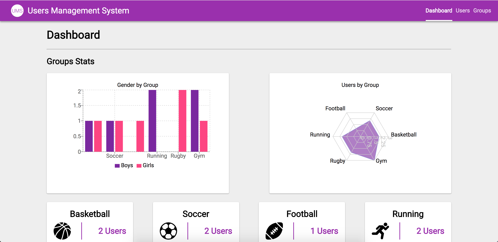

# InterNations Coding Challenge

Site is Avalaible at https://irvingv8.github.io/internations-ums/



The solution is a PWA backed with Firebase (so there it's a real time app).


## Q/A

Q: Why a PWA ?

A: I've been wanting to build one forever ([And this talk from Addy Osmani just made it worse](https://www.youtube.com/watch?v=aCMbSyngXB4))

Q: Why Firebase ?

A: Watching the graphs update in my desktop while I changed something in my phone was just worth it.

Q: How do I run this locally?

A: Clone/Download this repo and:
```
npm install
npm start
```
or
```
yarn install
yarn start
```
Q: Issues ?

A: Sure! First time playing around with a non-relational DB, so mistakes were made. Also, I'm still figuring out how to deal with redux state and firebase when updating data (Once you push something, Firebase will hit back you API with the new data, which you just updated via an action creator, so you end up updating your state twice?, still figuring this out)

***

## The stack involved:
* Firebase
* React
* React-Dom
* React-Router-Dom
* React-Select
* Recharts
* Redux
* React-Redux
* Redux-Form
* Redux-Thunk

***

## Some tests:

* You can add users and assign them to groups.
* You can update users data.
* You can delete users.
* You can create groups.
* You can update groups data.
* You can delete groups.
* You can open 2 tabs side by side, make changes in one of them and see how the other one gets updated automatically.
* You can open the site on your phone and add it to the homescreen.*
  * Haven't test this on iOS.
  * On an Android device using chrome you can hit three dots at the top right corner and select "Add to Home screen" to get an app-like experience (screenshot 5).
  * Or you can visit the site, wait at least 5 minutes, an visit it again to get and install banner like in screenshot 1.

## Screenshots


